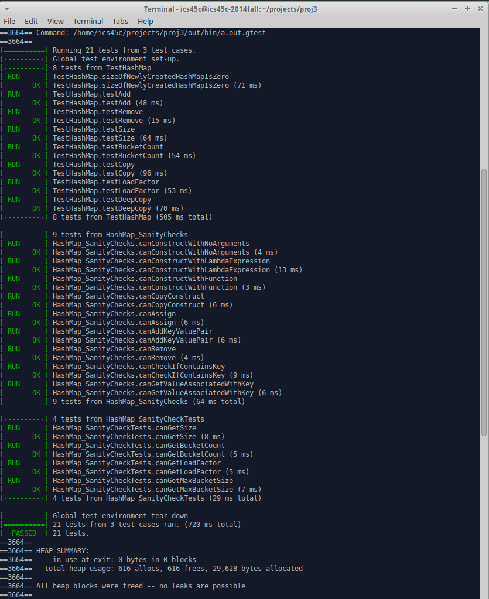

HashMap
=======

UC Irvine ICS 45C Project3 Build implementation of HashMap

http://www.ics.uci.edu/~thornton/ics45c/ProjectGuide/Project3/

I think the hardest part of this project is not implementation of HashMap itself, but how to build it without any memory leak and pass the Google Test Framework.

